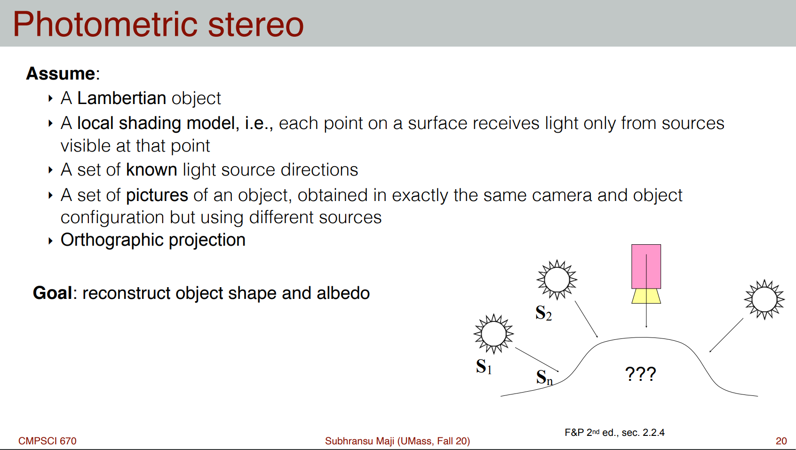
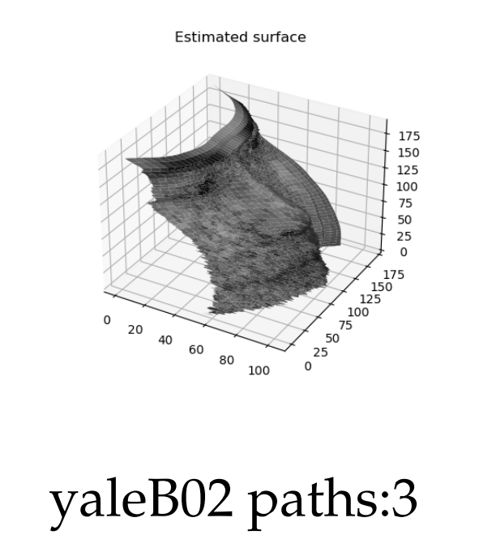

# Photometric-Stereo
# (Shape from Shading algorithm)  
  
  
Input: a set of photographs of a static scene taken with known lighting directions  
Output: albedo (paint), normal directions, and the height map  

*Slides are credited to Subhransu Maji, associate professor in the College of Information and Computer Sciences at the University of Massachusetts, Amherst.*
  
  
  

## Compute the surface height map by integration
- ### Method 1: Integrating first the rows, then the columns  
  
---
- ### Method 2: Integrating first the columns, then the rows  
  
---
- ### Method 3: Average of method 1 and 2  
  
---
- ### Method 4: Average of multiple **random paths**  
  
  

